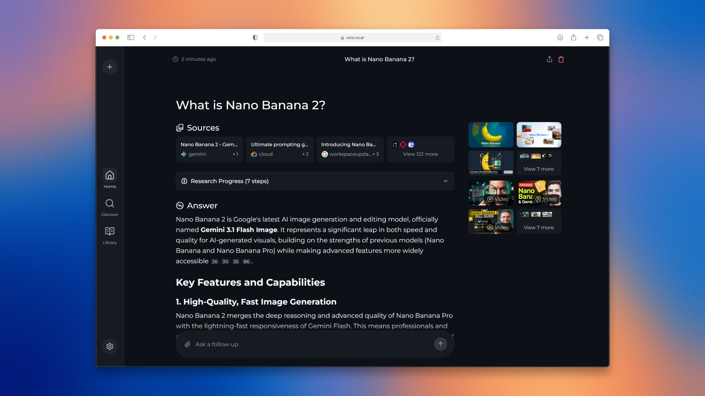

# Vane-MU 🔍

[](https://github.com/ItzCrazyKns/Vane/stargazers)
[](https://github.com/ItzCrazyKns/Vane/network/members)
[](https://github.com/ItzCrazyKns/Vane/watchers)
[](https://hub.docker.com/r/itzcrazykns1337/vane)
[](https://github.com/ItzCrazyKns/Vane/blob/master/LICENSE)
[](https://github.com/ItzCrazyKns/Vane/commits/master)
[](https://discord.gg/26aArMy8tT)

**Vane-MU** is the multi-user fork of [Vane](https://github.com/ItzCrazyKns/Vane), a privacy-focused AI answering engine. Vane-MU extends Vane with built-in user authentication, role-based access control, and a dedicated admin panel — allowing you to run a private AI search platform for multiple users.



> 📖 **Architecture** — Want to know how Vane works under the hood? See the [Original Vane Architecture Docs](https://github.com/ItzCrazyKns/Vane/tree/master/docs/architecture/README.md).

## ✨ Features

All the original Vane features, plus multi-user support:

### Original Vane Features

🤖 **Support for all major AI providers** - Use local LLMs through Ollama or connect to OpenAI, Anthropic Claude, Google Gemini, Groq, and more. Mix and match models based on your needs.

⚡ **Smart search modes** - Choose Speed Mode when you need quick answers, Balanced Mode for everyday searches, or Quality Mode for deep research.

🧭 **Pick your sources** - Search the web, discussions, or academic papers. More sources and integrations are in progress.

🧩 **Widgets** - Helpful UI cards that show up when relevant, like weather, calculations, stock prices, and other quick lookups.

🔍 **Web search powered by SearxNG** - Access multiple search engines while keeping your identity private. Support for Tavily and Exa coming soon for even better results.

𝕏 **Optional X search powered by Xquik** - Set `XQUIK_API_KEY` to add current public X posts to discussion searches. Follow the [Xquik quickstart](https://docs.xquik.com/quickstart) to create an API key. Xquik is an independent closed-source hosted service. Not affiliated with X Corp. "Twitter" and "X" are trademarks of X Corp.

📷 **Image and video search** - Find visual content alongside text results. Search isn't limited to just articles anymore.

📄 **File uploads** - Upload documents and ask questions about them. PDFs, text files, images - Vane understands them all.

🌐 **Search specific domains** - Limit your search to specific websites when you know where to look. Perfect for technical documentation or research papers.

💡 **Smart suggestions** - Get intelligent search suggestions as you type, helping you formulate better queries.

📚 **Discover** - Browse interesting articles and trending content throughout the day. Stay informed without even searching.

🕒 **Search history** - Every search is saved locally so you can revisit your discoveries anytime. Your research is never lost.

### Multi-User Features (Vane-MU)

- **🔐 User Authentication** — Local username/password accounts. No third-party SSO required.
- **👤 User Management** — Admins can create, reset passwords, and delete user accounts.
- **🛡️ Role-Based Access Control** — Two roles: `admin` and `user`. Admin-only settings (Models, Search) are hidden from regular users.
- **⚙️ Admin Panel** — A dedicated `/admin` dashboard for managing users and configuring system-wide settings.
- **📊 Per-User History** — Search history is scoped to each user account.
- **🚪 Logout Button** — Available in the sidebar for all users.

## 🏗️ User Roles

| Role | Access |
|------|--------|
| `admin` | Full access: Settings (Preferences, Personalization, Models, Search), Admin Panel, User Management |
| `user` | Settings: Preferences and Personalization only. No access to Models, Search, or Admin Panel. |

## 🚀 Getting Started

### Prerequisites

- Node.js 18+
- npm or yarn
- [SearXNG](https://github.com/searxng/searxng) instance (or use the bundled instance via Docker)
- One or more AI provider API keys (OpenAI, Claude, Gemini, Groq, Ollama, etc.)

### Option 1 — Docker (Recommended)

**Using pre-built Vane-MU image:**

```bash
docker run -d -p 3000:3000 -v vane-mu-data:/home/vane/data --name vane-mu itzcrazykns1337/vane:latest
```

Open http://localhost:3000 and complete the first-time setup (this creates the initial admin account).

**Build from source:**

```bash
# Clone the repository
git clone https://github.com/s3tupw1zard/Vane.git
cd Vane

# Build with Docker
docker build -t vane-mu .
docker run -d -p 3000:3000 -v vane-mu-data:/home/vane/data --name vane-mu vane-mu
```

### Option 2 — Docker Compose

```bash
git clone https://github.com/s3tupw1zard/Vane.git
cd Vane
docker-compose up -d
```

### Option 3 — Local Development

```bash
git clone https://github.com/s3tupw1zard/Vane.git
cd Vane
npm install
npm run dev
```

Then open http://localhost:3000 and complete the setup wizard to create your admin account.

## 🔑 Default Admin Credentials (First Setup)

On first run, the setup wizard prompts you to create an admin account. This is the only time an account can be created without authentication — after that, only admins can add users.

## ⚙️ Admin Panel

Access the admin panel by clicking the **gear icon → Admin Panel** in the sidebar (admin users only).

### User Management

- View all registered users (username, role, creation date)
- Create new user accounts
- Reset a user's password
- Delete user accounts

### System Settings

- **Models** — Configure AI model providers and endpoints (admin only)
- **Search** — Configure SearXNG and search behaviour (admin only)

## 🌐 Environment Variables

| Variable | Default | Description |
|----------|---------|-------------|
| `SEARXNG_API_URL` | `http://localhost:8080` | SearXNG instance URL |
| `DATABASE_URL` | `file:./data/vane.db` | SQLite database path |
| `SESSION_SECRET` | _(required)_ | Secret for signing session tokens |
| `JWT_SECRET` | _(required in production)_ | Secret for JWT tokens. In production (`NODE_ENV=production`), the app refuses to start without this. |
| `NEXT_PUBLIC_VERSION` | `1.12.2` | Version shown in Settings footer |
| `XQUIK_API_KEY` | _(optional)_ | Xquik API key for X/Twitter search integration |

## 🔒 Security Notes

- Passwords are hashed with **bcryptjs**
- Sessions are managed via **HTTP-only cookies** using **jose** (JWT)
- Admin API routes are protected by server-side `requireAdmin` middleware
- Users cannot access or configure AI model providers or search settings
- **JWT_SECRET enforcement**: In production (`NODE_ENV=production`), the app **refuses to start** without a valid `JWT_SECRET` environment variable — there is no fallback. In development, a placeholder key is used with a console warning. To set in production:
  ```bash
  docker run -e JWT_SECRET=your-secret-here -e NODE_ENV=production ...
  ```

## 📁 Project Structure

```
src/
├── app/
│   ├── admin/              # Admin panel page
│   └── api/
│       ├── admin/          # Admin-only API routes (user management, settings)
│       ├── auth/           # Authentication (login, logout, session)
│       └── config/         # Public config API
├── components/
│   ├── admin/              # Admin panel UI components
│   └── Settings/           # Settings dialog and sections
├── lib/
│   ├── hooks/useAuth.tsx   # Authentication context & hooks
│   └── middleware/         # Auth middleware (requireAdmin, etc.)
drizzle/                    # Database migrations
```

## 📝 User Management API

Admin-only endpoints under `/api/admin/`:

| Method | Endpoint | Description |
|--------|----------|-------------|
| `GET` | `/api/admin/users` | List all users |
| `POST` | `/api/admin/users` | Create a new user |
| `PUT` | `/api/admin/users/reset` | Reset a user's password |
| `DELETE` | `/api/admin/users` | Delete a user |
| `GET` | `/api/admin/settings` | Get admin-only settings |
| `PUT` | `/api/admin/settings` | Update admin settings |

## 🔄 Migrating from Single-User Vane

Vane-MU uses a SQLite database (`data/vane.db`) managed by Drizzle ORM. On first launch, run migrations:

```bash
npm run db:migrate
```

Or let the Docker entrypoint handle it automatically.

## 📄 License

MIT — same as the original [Vane](https://github.com/ItzCrazyKns/Vane) project.

## 🙏 Acknowledgements

Vane-MU is built on the excellent work of the [Vane](https://github.com/ItzCrazyKns/Vane) project by ItzCrazyKns. This fork adds multi-user functionality while preserving the privacy-first, self-hosted philosophy of the original.

## Sponsors

Vane's development is powered by the generous support of our sponsors. Their contributions help keep this project free, open-source, and accessible to everyone.

<div align="center">

<a href="https://www.warp.dev/perplexica">
  
</a>

### **✨ [Try Warp - The AI-Powered Terminal →](https://www.warp.dev/vane)**

Warp is revolutionizing development workflows with AI-powered features, modern UX, and blazing-fast performance. Used by developers at top companies worldwide.

</div>

---

We'd also like to thank the following partners for their generous support:

<table>
  <tr>
    <td width="100" align="center">
      <a href="https://dashboard.exa.ai" target="_blank">
        
      </a>
    </td>
    <td>
      <a href="https://dashboard.exa.ai">Exa</a> • The Perfect Web Search API for LLMs - web search, crawling, deep research, and answer APIs
    </td>
  </tr>
</table>

## Installation

There are mainly 2 ways of installing Vane - With Docker, Without Docker. Using Docker is highly recommended.

### Getting Started with Docker (Recommended)

Vane can be easily run using Docker. Simply run the following command:

```bash
docker run -d -p 3000:3000 -v vane-data:/home/vane/data --name vane itzcrazykns1337/vane:latest
```

This will pull and start the Vane container with the bundled SearxNG search engine. Once running, open your browser and navigate to http://localhost:3000. You can then configure your settings (API keys, models, etc.) directly in the setup screen.

**Note**: The image includes both Vane and SearxNG, so no additional setup is required. The `-v` flags create persistent volumes for your data and uploaded files.

#### Using Vane with Your Own SearxNG Instance

If you already have SearxNG running, you can use the slim version of Vane:

```bash
docker run -d -p 3000:3000 -e SEARXNG_API_URL=http://your-searxng-url:8080 -v vane-data:/home/vane/data --name vane itzcrazykns1337/vane:slim-latest
```

**Important**: Make sure your SearxNG instance has:

- JSON format enabled in the settings
- Wolfram Alpha search engine enabled

Replace `http://your-searxng-url:8080` with your actual SearxNG URL. Then configure your AI provider settings in the setup screen at http://localhost:3000.

#### Using You.com as the Search Provider

Instead of running a SearXNG instance, you can use the [You.com Search API](https://you.com/) as the web search backend:

```bash
docker run -d -p 3000:3000 \
  -e SEARCH_PROVIDER=youcom \
  -e YDC_API_KEY=your-youcom-api-key \
  -v vane-data:/home/vane/data \
  --name vane itzcrazykns1337/vane:slim-latest
```

You can also set `SEARCH_PROVIDER=youcom` and `YDC_API_KEY` in the Settings → Search section of the setup screen. When the provider is set to `youcom`, the main web search uses the You.com Search API; image, video, and news discovery still use SearXNG (they rely on SearXNG's engine-specific capabilities).

#### Advanced Setup (Building from Source)

If you prefer to build from source or need more control:

1. Ensure Docker is installed and running on your system.
2. Clone the Vane repository:

   ```bash
   git clone https://github.com/ItzCrazyKns/Vane.git
   ```

3. After cloning, navigate to the directory containing the project files.

4. Build and run using Docker:

   ```bash
   docker build -t vane .
   docker run -d -p 3000:3000 -v vane-data:/home/vane/data --name vane vane
   ```

5. Access Vane at http://localhost:3000 and configure your settings in the setup screen.

**Note**: After the containers are built, you can start Vane directly from Docker without having to open a terminal.

### Non-Docker Installation

1. Install SearXNG and allow `JSON` format in the SearXNG settings. Make sure Wolfram Alpha search engine is also enabled.
2. Clone the repository:

   ```bash
   git clone https://github.com/ItzCrazyKns/Vane.git
   cd Vane
   ```

3. Install dependencies:

   ```bash
   npm i
   ```

4. Build the application:

   ```bash
   npm run build
   ```

5. Start the application:

   ```bash
   npm run start
   ```

6. Open your browser and navigate to http://localhost:3000 to complete the setup and configure your settings (API keys, models, SearxNG URL, etc.) in the setup screen.

**Note**: Using Docker is recommended as it simplifies the setup process, especially for managing environment variables and dependencies.

See the [installation documentation](https://github.com/ItzCrazyKns/Vane/tree/master/docs/installation) for more information like updating, etc.

## Troubleshooting

#### Local OpenAI-API-Compliant Servers

If Vane tells you that you haven't configured any chat model providers, ensure that:

1. Your server is running on `0.0.0.0` (not `127.0.0.1`) and on the same port you put in the API URL.
2. You have specified the correct model name loaded by your local LLM server.
3. You have specified the correct API key, or if one is not defined, you have put _something_ in the API key field and not left it empty.

#### Ollama Connection Errors

If you're encountering an Ollama connection error, it is likely due to the backend being unable to connect to Ollama's API. To fix this issue you can:

1. **Check your Ollama API URL:** Ensure that the API URL is correctly set in the settings menu.
2. **Update API URL Based on OS:**

   - **Windows:** Use `http://host.docker.internal:11434`
   - **Mac:** Use `http://host.docker.internal:11434`
   - **Linux:** Use `http://<private_ip_of_host>:11434`

   Adjust the port number if you're using a different one.

3. **Linux Users - Expose Ollama to Network:**

   - Inside `/etc/systemd/system/ollama.service`, you need to add `Environment="OLLAMA_HOST=0.0.0.0:11434"`. (Change the port number if you are using a different one.) Then reload the systemd manager configuration with `systemctl daemon-reload`, and restart Ollama by `systemctl restart ollama`. For more information see [Ollama docs](https://github.com/ollama/ollama/blob/main/docs/faq.md#setting-environment-variables-on-linux)

   - Ensure that the port (default is 11434) is not blocked by your firewall.

#### Lemonade Connection Errors

If you're encountering a Lemonade connection error, it is likely due to the backend being unable to connect to Lemonade's API. To fix this issue you can:

1. **Check your Lemonade API URL:** Ensure that the API URL is correctly set in the settings menu.
2. **Update API URL Based on OS:**

   - **Windows:** Use `http://host.docker.internal:8000`
   - **Mac:** Use `http://host.docker.internal:8000`
   - **Linux:** Use `http://<private_ip_of_host>:8000`

   Adjust the port number if you're using a different one.

3. **Ensure Lemonade Server is Running:**

   - Make sure your Lemonade server is running and accessible on the configured port (default is 8000).
   - Verify that Lemonade is configured to accept connections from all interfaces (`0.0.0.0`), not just localhost (`127.0.0.1`).
   - Ensure that the port (default is 8000) is not blocked by your firewall.

## Using as a Search Engine

If you wish to use Vane as an alternative to traditional search engines like Google or Bing, or if you want to add a shortcut for quick access from your browser's search bar, follow these steps:

1. Open your browser's settings.
2. Navigate to the 'Search Engines' section.
3. Add a new site search with the following URL: `http://localhost:3000/?q=%s`. Replace `localhost` with your IP address or domain name, and `3000` with the port number if Vane is not hosted locally.
4. Click the add button. Now, you can use Vane directly from your browser's search bar.

## Using Vane's API

Vane also provides an API for developers looking to integrate its powerful search engine into their own applications. You can run searches, use multiple models and get answers to your queries.

For more details, check out the full documentation [here](https://github.com/ItzCrazyKns/Vane/tree/master/docs/API/SEARCH.md).

## Expose Vane to network

Vane runs on Next.js and handles all API requests. It works right away on the same network and stays accessible even with port forwarding.

## One-Click Deployment

[](https://usw.sealos.io/?openapp=system-template%3FtemplateName%3Dperplexica)
[](https://repocloud.io/details/?app_id=267)
[](https://template.run.claw.cloud/?referralCode=U11MRQ8U9RM4&openapp=system-fastdeploy%3FtemplateName%3Dperplexica)
[](https://www.hostinger.com/vps/docker-hosting?compose_url=https://raw.githubusercontent.com/ItzCrazyKns/Vane/refs/heads/master/docker-compose.yaml)

## Upcoming Features

- [ ] Adding more widgets, integrations, search sources
- [ ] Adding ability to create custom agents (name T.B.D.)

## Support Us

If you find Vane useful, consider giving us a star on GitHub. This helps more people discover Vane and supports the development of new features. Your support is greatly appreciated.

### Donations

We also accept donations to help sustain our project. If you would like to contribute, you can use the following options to donate. Thank you for your support!

| Ethereum                                              |
| ----------------------------------------------------- |
| Address: `0xB025a84b2F269570Eb8D4b05DEdaA41D8525B6DD` |

## Contribution

Vane is built on the idea that AI and large language models should be easy for everyone to use. If you find bugs or have ideas, please share them in via GitHub Issues. For more information on contributing to Vane you can read the [CONTRIBUTING.md](CONTRIBUTING.md) file to learn more about Vane and how you can contribute.

## Help and Support

If you have any questions or feedback, please feel free to reach out to us. You can create an issue on GitHub or join our Discord server. There, you can connect with other users, share your experiences and reviews, and receive more personalized help. [Click here](https://discord.gg/EFwsmQDgAu) to join the Discord server. To discuss matters outside of regular support, feel free to contact me on Discord at `itzcrazykns`.

Thank you for exploring Vane, the AI-powered search engine designed to enhance your search experience. We are constantly working to improve Vane and expand its capabilities. We value your feedback and contributions which help us make Vane even better. Don't forget to check back for updates and new features!
